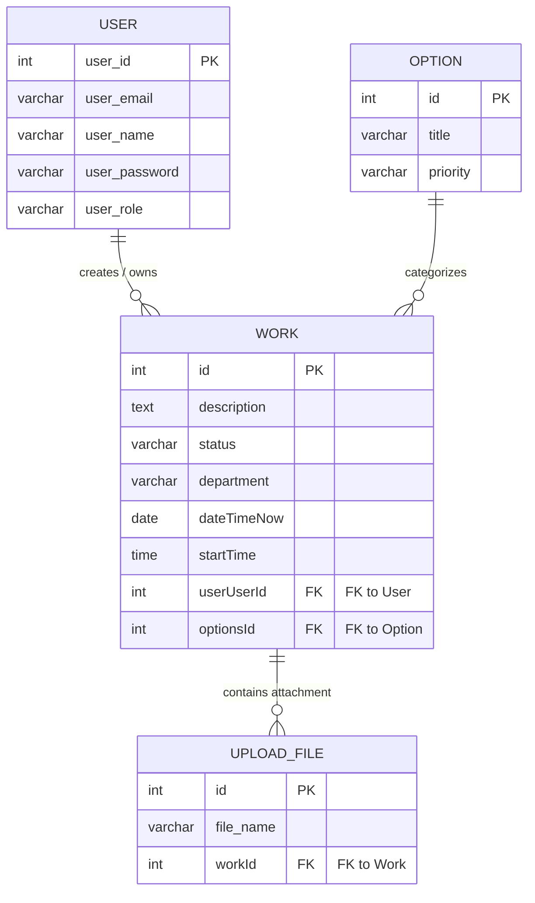

# Support-Staff-Workload-System

Project สำหรับการศึกษา เป็นเว็บแอปพลิเคชัน Full Stack ที่พัฒนาโดยนักศึกษามหาวิทยาลัยพะเยา

## Tech Stack

**Frontend:**

- React (Vite)
- TypeScript
- Tailwind CSS
- Ant Design (AntD)

**Backend:**

- NestJS
- TypeORM
- MySQL
- Passport (JWT Authentication)

**Infrastructure:**

- Docker & Docker Compose
- Nginx

## สิ่งที่ต้องเตรียม (Prerequisites)

- [Docker Desktop](https://docs.docker.com/desktop/) สำหรับจัดการ Container และ Database

## การติดตั้งและเริ่มต้นใช้งาน (Installation)

โปรเจกต์นี้ถูกตั้งค่าให้รันด้วย Docker Compose เพื่อความสะดวกในการติดตั้ง

1. Clone repository
2. เปิด Terminal ในโฟลเดอร์โปรเจกต์
3. รันคำสั่งเพื่อเริ่มระบบ:

```bash
docker-compose up -d
```

คำสั่งนี้จะทำการ build และ start services ทั้งหมด (Frontend, Backend, Database, phpMyAdmin, Nginx)

## การใช้งาน (Usage)

เมื่อ Container เริ่มทำงานเสร็จสมบูรณ์ สามารถเข้าใช้งานได้ผ่าน URL ดังนี้:

- **Frontend:** [http://localhost:8080](http://localhost:8080)
- **Backend API:** [http://localhost:3001](http://localhost:3001)
- **phpMyAdmin:** [http://localhost:8081](http://localhost:8081)

## ข้อมูล Database (Database Credentials)

**MySQL Connection:**

- **Host:** localhost
- **Port:** 3306
- **Username:** root
- **Password:** root
- **Database:** project

**phpMyAdmin Login:**

- **Server:** db
- **Username:** root
- **Password:** root

## การหยุดการทำงาน

หากต้องการหยุด Container ทั้งหมด ให้รันคำสั่ง:

```bash
docker-compose down
```


