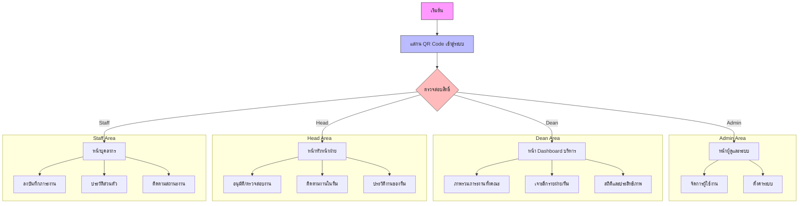
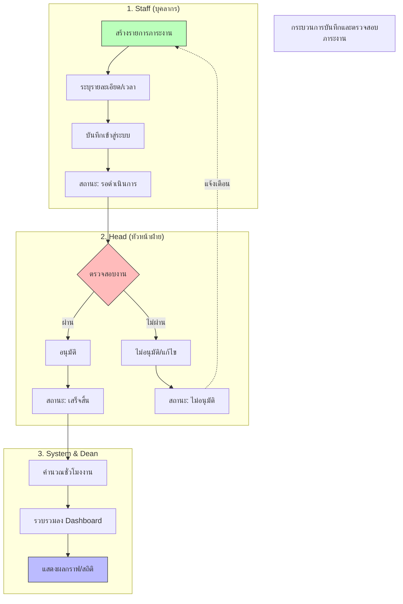
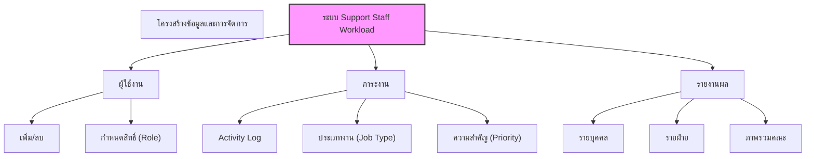

```mermaid
graph TD
    Start[เริ่มต้น] --> Login[แสกน QR Code เข้าสู่ระบบ]
    Login --> Check{ตรวจสอบสิทธิ์}
    
    Check -->|Admin| AdminDash[หน้าผู้ดูและระบบ]
    Check -->|Dean| DeanDash[หน้า Dashboard บริหาร]
    Check -->|Head| HeadDash[หน้าหัวหน้าฝ่าย]
    Check -->|Staff| UserDash[หน้าบุคลากร]

    subgraph "Admin Area"
        AdminDash --> AdminUser[จัดการผู้ใช้งาน]
        AdminDash --> AdminConfig[ตั้งค่าระบบ]
    end

    subgraph "Dean Area"
        DeanDash --> DeanOverview[ภาพรวมภาระงานทั้งคณะ]
        DeanDash --> DeanDrill[เจาะลึกรายฝ่าย/ทีม]
        DeanDash --> DeanStats[สถิติและประสิทธิภาพ]
    end

    subgraph "Head Area"
        HeadDash --> HeadApprove[อนุมัติ/ตรวจสอบงาน]
        HeadDash --> HeadTeam[ติดตามงานในทีม]
        HeadDash --> HeadHistory[ประวัติงานของทีม]
    end

    subgraph "Staff Area"
        UserDash --> UserCreate[ลงบันทึกภาระงาน]
        UserDash --> UserHistory[ประวัติส่วนตัว]
        UserDash --> UserStatus[ติดตามสถานะงาน]
    end

    style Start fill:#f9f,stroke:#333
    style Login fill:#bbf,stroke:#333
    style Check fill:#fbb,stroke:#333
```

```mermaid
graph TD
    title[กระบวนการบันทึกและตรวจสอบภาระงาน]
    
    subgraph "1. Staff (บุคลากร)"
        Create[สร้างรายการภาระงาน] --> Fill[ระบุรายละเอียด/เวลา]
        Fill --> Submit[บันทึกเข้าสู่ระบบ]
        Submit --> Wait[สถานะ: รอดำเนินการ]
    end

    subgraph "2. Head (หัวหน้าฝ่าย)"
        Wait --> Review{ตรวจสอบงาน}
        Review -->|ผ่าน| Approve[อนุมัติ]
        Review -->|ไม่ผ่าน| Reject[ไม่อนุมัติ/แก้ไข]
        
        Approve --> Complete[สถานะ: เสร็จสิ้น]
        Reject --> Return[สถานะ: ไม่อนุมัติ]
        Return -.->|แจ้งเตือน| Create
    end

    subgraph "3. System & Dean"
        Complete --> Calculate[คำนวณชั่วโมงงาน]
        Calculate --> Agg[รวบรวมลง Dashboard]
        Agg --> Visualize[แสดงผลกราฟ/สถิติ]
    end

    style Create fill:#bfb,stroke:#333
    style Review fill:#fbb,stroke:#333
    style Visualize fill:#bbf,stroke:#333
```

```mermaid
graph TD
    title[โครงสร้างข้อมูลและการจัดการ]

    Root[ระบบ Support Staff Workload]
    
    Root --> Users[ผู้ใช้งาน]
    Users --> U_Add[เพิ่ม/ลบ]
    Users --> U_Role["กำหนดสิทธิ์ (Role)"]
    
    Root --> Workloads[ภาระงาน]
    Workloads --> W_Log[Activity Log]
    Workloads --> W_Type["ประเภทงาน (Job Type)"]
    Workloads --> W_Prio["ความสำคัญ (Priority)"]

    Root --> Reports[รายงานผล]
    Reports --> R_Ind[รายบุคคล]
    Reports --> R_Dept[รายฝ่าย]
    Reports --> R_Fac[ภาพรวมคณะ]

    style Root fill:#f9f,stroke:#333,stroke-width:2px
```